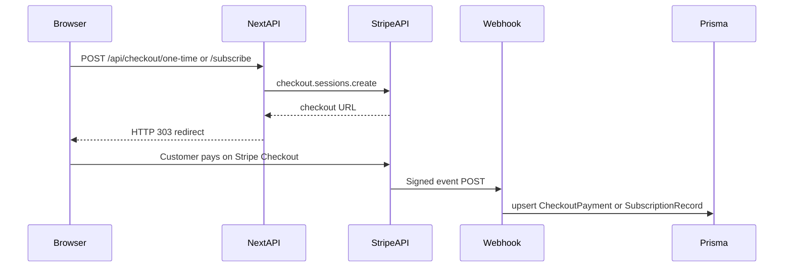

# Architecture

This repository is a **pnpm-workspace mono-repo** with independent payment-integration demos. Each sub-project is a **Next.js (App Router)** app with **Prisma 6 + SQLite**.

## Workspace Layout

```
payment-examples/
├── stripe-checkout/      # Stripe Checkout (one-time + subscription)
└── docs/
    └── stripe/           # Stripe setup guides
```

---

## Stripe Checkout Flow



### Persistence

| Model | Written when |
|-------|----------------|
| `CheckoutPayment` | `checkout.session.completed` with `mode=payment` |
| `SubscriptionRecord` | Subscription checkout completes or subscription status webhooks |

### Key files

| Path | Role |
|------|------|
| [stripe-checkout/src/app/api/checkout/one-time/route.ts](../stripe-checkout/src/app/api/checkout/one-time/route.ts) | Stripe Checkout Session, `mode: payment` |
| [stripe-checkout/src/app/api/checkout/subscribe/route.ts](../stripe-checkout/src/app/api/checkout/subscribe/route.ts) | Stripe Checkout Session, `mode: subscription` |
| [stripe-checkout/src/app/api/webhooks/stripe/route.ts](../stripe-checkout/src/app/api/webhooks/stripe/route.ts) | Signature verification + DB writes |
| [stripe-checkout/prisma/schema.prisma](../stripe-checkout/prisma/schema.prisma) | SQLite models |

---

## Postgres (optional swap)

Replace `provider = "sqlite"` with PostgreSQL in either app's `schema.prisma`, set `DATABASE_URL` to your connection string, and run `pnpm db:migrate`. SQLite stays simplest for local demos.
