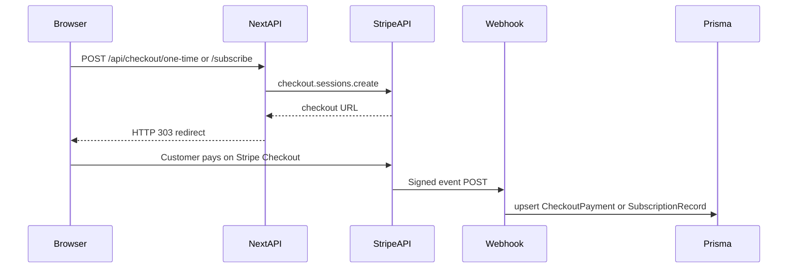
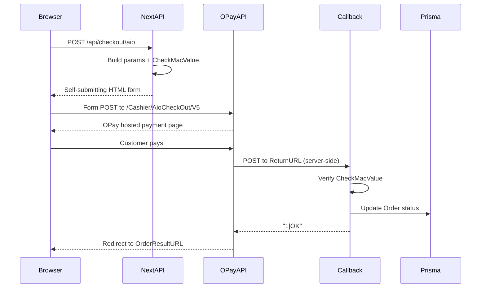
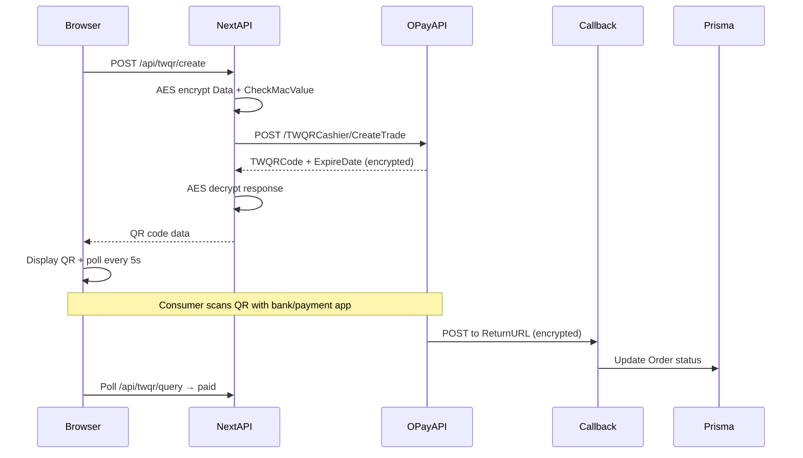
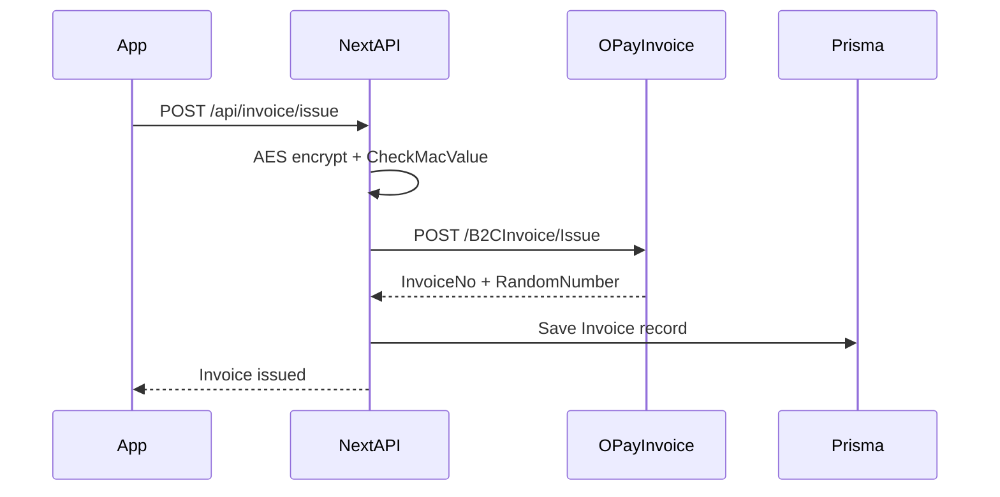
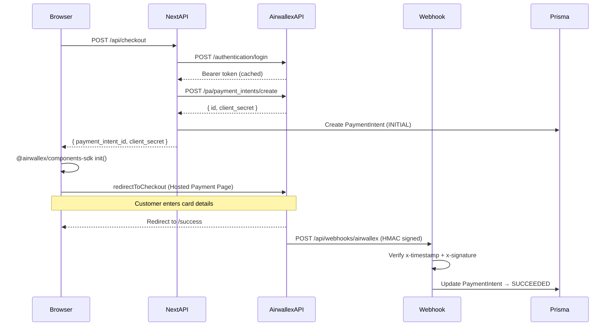
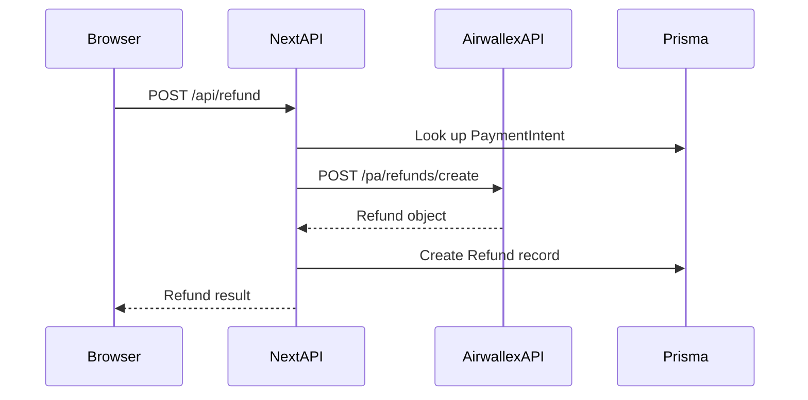

# Architecture

This repository is a **pnpm-workspace mono-repo** with independent payment-integration demos. Each sub-project is a **Next.js (App Router)** app with **Prisma 6 + SQLite**.

## Workspace Layout

```
payment-examples/
├── stripe-checkout/      # Stripe Checkout (one-time + subscription)
├── opay-payment/         # OPay 歐付寶 (AIO credit card, TWQR, e-invoice, refund, reports)
├── airwallex-payment/    # Airwallex (Hosted Payment Page, webhook, refund)
└── docs/
    ├── stripe/           # Stripe setup guides
    ├── opay/             # OPay PDF specs (TWQR, AIO, e-invoice, merchant backend)
    └── airwallex/        # Airwallex setup + local verify
```

---

## Stripe Checkout Flow



### Persistence

| Model | Written when |
|-------|----------------|
| `CheckoutPayment` | `checkout.session.completed` with `mode=payment` |
| `SubscriptionRecord` | Subscription checkout completes or subscription status webhooks |

### Key files

| Path | Role |
|------|------|
| [stripe-checkout/src/app/api/checkout/one-time/route.ts](../stripe-checkout/src/app/api/checkout/one-time/route.ts) | Stripe Checkout Session, `mode: payment` |
| [stripe-checkout/src/app/api/checkout/subscribe/route.ts](../stripe-checkout/src/app/api/checkout/subscribe/route.ts) | Stripe Checkout Session, `mode: subscription` |
| [stripe-checkout/src/app/api/webhooks/stripe/route.ts](../stripe-checkout/src/app/api/webhooks/stripe/route.ts) | Signature verification + DB writes |
| [stripe-checkout/prisma/schema.prisma](../stripe-checkout/prisma/schema.prisma) | SQLite models |

---

## OPay 歐付寶 Flow

### AIO Credit Card Payment



### TWQR Dynamic QR Code Payment



### E-Invoice Flow



### Persistence

| Model | Written when |
|-------|-------------|
| `Merchant` | Seed or admin setup (B2B2C sub-merchants) |
| `Order` | AIO checkout or TWQR create; updated on callback |
| `Invoice` | E-Invoice issued; updated on void |
| `Refund` | DoAction refund or TWQR chargeback |

### Key files

| Path | Role |
|------|------|
| `opay-payment/src/lib/opay/check-mac-value.ts` | HMAC-SHA256 CheckMacValue |
| `opay-payment/src/lib/opay/aes-encrypt.ts` | AES-128-CBC-PKCS7 encrypt/decrypt |
| `opay-payment/src/lib/opay/aio-client.ts` | AIO payment API wrapper |
| `opay-payment/src/lib/opay/twqr-client.ts` | TWQR QR payment API wrapper |
| `opay-payment/src/lib/opay/invoice-client.ts` | E-Invoice API wrapper |
| `opay-payment/prisma/schema.prisma` | Merchant, Order, Invoice, Refund models |

---

## Airwallex Payment Flow



### Refund Flow



### Persistence

| Model | Written when |
|-------|-------------|
| `PaymentIntent` | Checkout creates intent; webhook updates status |
| `Refund` | Refund request; webhook confirms |

### Key files

| Path | Role |
|------|------|
| `airwallex-payment/src/lib/airwallex/auth.ts` | Bearer token acquisition + cache |
| `airwallex-payment/src/lib/airwallex/client.ts` | Payment intent + refund API wrappers |
| `airwallex-payment/src/lib/airwallex/webhook.ts` | HMAC-SHA256 signature verification |
| `airwallex-payment/src/app/api/checkout/route.ts` | Create payment intent |
| `airwallex-payment/src/app/api/webhooks/airwallex/route.ts` | Webhook handler |
| `airwallex-payment/prisma/schema.prisma` | PaymentIntent, Refund models |

---

## Postgres (optional swap)

Replace `provider = "sqlite"` with PostgreSQL in either app's `schema.prisma`, set `DATABASE_URL` to your connection string, and run `pnpm db:migrate`. SQLite stays simplest for local demos.
