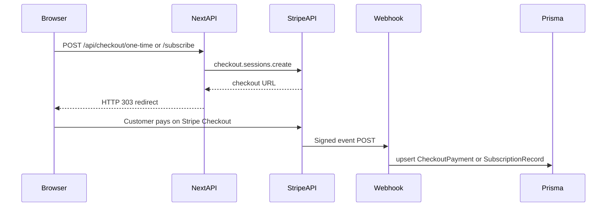

# Architecture

This repository is a **single Next.js (App Router) app** with Route Handlers acting as the backend. Data is stored in **SQLite** via **Prisma 6** (classic engine; no driver adapter required for local demos).

## Flow

## Persistence

| Model | Written when |
|-------|----------------|
| `CheckoutPayment` | `checkout.session.completed` with `mode=payment` |
| `SubscriptionRecord` | Subscription checkout completes (via session + subscription retrieval) or subscription status webhooks |

## Key files

| Path | Role |
|------|------|
| [src/app/api/checkout/one-time/route.ts](../src/app/api/checkout/one-time/route.ts) | Stripe Checkout Session, `mode: payment` |
| [src/app/api/checkout/subscribe/route.ts](../src/app/api/checkout/subscribe/route.ts) | Stripe Checkout Session, `mode: subscription` |
| [src/app/api/webhooks/stripe/route.ts](../src/app/api/webhooks/stripe/route.ts) | Signature verification + DB writes |
| [prisma/schema.prisma](../prisma/schema.prisma) | SQLite models |

## Postgres (optional swap)

Replace `provider = "sqlite"` with PostgreSQL in `schema.prisma`, set `DATABASE_URL` to your connection string, and run `pnpm db:migrate` again. Hosted templates often use Postgres for serverless concurrency; SQLite stays simplest for community clones.
